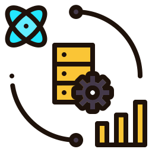

# Conceptual

Image by [Flowicon](https://www.freepik.com/icon/data-science_6097658)

***Credits*** :
> [DataCamp (Associate Data Engineer in SQL)](https://www.datacamp.com/tracks/associate-data-engineer-in-sql)

## Data Workflow

Data mengalir dari hulu ke hilir dengan 4 tahap :

1. Data Collection & Storage (Data Engineer)
2. Data Preparation (Data Engineer & Data Analyst & Data Scientist)
3. Exploration & Visualization (Data Analyst & Data Scientist)
4. Experimentation & Prediction (Data Scientist)

## The Five V's of Big Data

Terdapat 5 komponen V yang membuat sebuah data dapat dikatakan sebagai Big Data :

- Volume = Seberapa besar data tersebut?
- Variety = Seberapa beragam data tersebut?
- Velocity = Seberapa cepat data tersebut dihasilkan?
- Veracity = Seberapa besar data tersebut dapat dipercaya?
- Value = Seberapa bergunanya data tersebut?

## SQL - ETL - Database Schema

### SQL

**SQL** adalah singkatan dari *Structured Query Language* dan digunakan untuk berinteraksi dengan *RDBMS* (Relational DataBase Management System)

### ETL

**ETL** adalah Framework yang populer dalam Data Engineering dan singkatan dari *Extract, Transform, Load* yang artinya data diproses terlebih dahulu sebelum disimpan (tetapi tidak wajib)

### Database Schema

Database Schema dapat diibaratkan sebagai Blueprint dari Database

## Data Structures

Terdapat 3 macam varian pada struktur data :

- Structured Data = Data yang terstruktur oleh tabel dalam bentuk kolom dan baris (menggunakan SQL untuk mengelolanya)
- Semi-Structured Data = Data yang lebih fleksibel dari Structured Data (contohnya seperti JSON, XML dan YAML)
- Unstructured Data = Data yang tidak terstruktur tetapi memiliki Value yang besar jika dapat dikelola (seperti foto, video dan lain-lain)

## Data Lake vs Data Warehouse vs Database

Ada 3 tipe dari tempat dimana kita dapat menyimpan data :

- Data Lake = Tempat dimana seluruh data dikumpulkan (dibutuhkan Data Catalog untuk mengimbangi ketidak strukturan pada Data Lake agar tidak menjadi Data Swamp)
- Data Warehouse = Tempat dimana data yang telah diolah dikumpulkan dan biasanya digunakan untuk Ad-Hoc dan Read Only
- Database = Secara umum Database dapat diartikan dengan tempat berkumpulnya suatu data yang telah dikelola (Data Warehouse termasuk bagian dari Database)

## Processing

Terdapat 3 macam penjadwalan dalam model Processing :

- Manual = Dilakukan secara mandiri (misalnya ada data yang perlu diperbarui secara mandiri)
- Time = Diproses saat memasuki waktu yang telah ditentukan (seperti memperbarui data karyawan setiap jam 6 pagi)
- Condition/Sensor = Memproses data saat data tersebut memenuhi kondisi yang telah ditentukan

Selain itu, ada 2 macam proses yang dapat digunakan untuk mengirim data :

- Batch Processing = Mengirim beberapa data sekaligus dalam interval waktu tertentu
- Stream Processing = Mengirim data individu langsung ke Database (seperti proses Register pada sebuah Platform)

## Parallel Processing

Parallel Processing digunakan untuk membagi beban kerja dalam sebuah proses yang membutuhkan daya komputasi yang besar

## Cloud Computing

Provider Cloud menyediakan alternatif yang dapat digunakan untuk menghemat biaya dibandingkan dengan On-Premise Server
