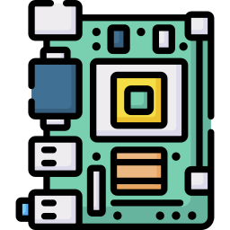

# Hardware

Image by [Magnific](https://www.magnific.com/icon/motherboard_4862018)

***Credits*** :
> [Gemini](https://gemini.google.com/app) -
> [ZaiSmart](https://www.youtube.com/watch?v=-fz1F91RvVg) -
> [TechMo ID](https://www.youtube.com/watch?v=a_N38iB5ZV4) -
> [freeCodeCamp.org](https://www.youtube.com/watch?v=FwNRb6MwXTI)

## Central Processing Unit (CPU)

***CPU/Processor/Microchip*** adalah "otak" dari sebuah komputer. Ia bertugas untuk mengambil, menghitung, memproses dan mengeksekusi instruksi atau perintah lalu mengembalikannya. Siklus ini berjalan jutaan hingga miliaran kali perdetik. Ada beberapa faktor yang menentukan performa dari suatu CPU :

- *Clock Speed* = Diukur dalam satuan Gigahertz (GHz), 1 GHz berarti CPU bisa mengeksekusi 1 miliar perintah dalam satu detik.
- *Core* = Inti dari sebuah CPU. Semakin banyak Core, semakin banyak perintah yang dapat dieksekusi secara bersamaan.
- *Thread* = Alur kerja Virtual yang membuat 1 Core dapat mengerjakan 2 tugas sekaligus secara bergantian dengan sangat cepat.
- *Cache* = Memori berkapasitas kecil yang terpasang langsung pada sebuah CPU. Digunakan untuk mengakses perintah yang paling sering digunakan.
- *Architecture* = Desain tata letak dan teknologi yang terpasang pada CPU. Untuk ukuran fabrikasi, dihitung dalam satuan Nanometer (nm).
- *Thermal Design Power* = Jumlah panas rata-rata yang dihasilkan CPU saat bekerja, dihitung dalam satuan Watt (W).

## Random Access Memory (RAM)

***Random Access Memory (RAM)*** adalah memori penyimpanan jangka pendek atau sementara, berisi instruksi/perintah yang akan diakses/dijalankan oleh CPU. Dengan penyimpanan yang relatif kecil, RAM dapat diakses dengan sangat cepat. Karena RAM membutuhkan aliran listrik saat bekerja, maka jika komputer dimatikan, data yang terdapat pada RAM juga ikut hilang (Volatile).

## Storage (HDD/SSD)

***Storage*** adalah memori penyimpanan jangka panjang yang datanya tidak akan hilang jika aliran listrik terputus (Non-Volatile). Digunakan untuk ditempatkannya sebuah sistem operasi, aplikasi dan data pengguna. Terdapat 2 jenis Storage saat ini :

- *HDD (Hard Disk Drive)* = Menggunakan piringan Magnetic yang berputar dan jarum mekanis untuk membaca dan menulis data didalamnya.
- *SSD (Solid State Drive)* = Menggunakan aliran listrik untuk membaca dan menulis data, sehingga proses Read-Write menjadi lebih cepat.

## Motherboard

***Motherboard*** adalah komponen dalam sebuah komputer yang berfungsi sebagai "jalan raya" untuk menghubungkan seluruh komponen Hardware yang terpasang, seluruh komponen Hardware saling berkomunikasi melalui jalur data yang disebut dengan Bus.

## Read-Only Memory (ROM)

***Read-Only Memory*** adalah komponen memori pada sebuah Motherboard. Tugasnya yaitu untuk menyimpan Firmware *BIOS (Basic Input/Output System)* lalu menjalankan *POST (Power-On Self-Test)* dan mengenalkan komponen Hardware lain kepada CPU, kemudian memerintahkan CPU untuk mencari program Bootloader di Storage agar dapat memuat sistem operasi pada RAM.

## Graphics Processing Unit (GPU)

***Graphics Processing Unit*** adalah komponen yang dapat melakukan proses/perhitungan sederhana namun secara Parallel untuk data yang masif, dan memiliki ribuan Core/inti didalamnya. Tidak seperti CPU yang melakukan proses/perhitungan secara berurutan/Sequential, GPU melakukan proses/perhitungan tersebut secara bersamaan/Parallel dalam satu waktu. GPU juga dapat berkomunikasi dengan komponen yang bernama VRAM (Video Random Access Memory), jika RAM digunakan untuk menyimpan instruksi umum, maka VRAM digunakan untuk menyimpan instruksi yang berkaitan dengan Visual.

## Network Interface Card (NIC)

***Network Interface Card*** adalah komponen Hardware yang bertugas untuk urusan jaringan, perangkat ini menjadi mata dan telinga sebuah komputer ke dunia luar. Ia mengubah data Digital pada komputer menjadi sinyal listrik, cahaya atau gelombang radio dan juga sebaliknya untuk menerima lalu mengubahnya.
